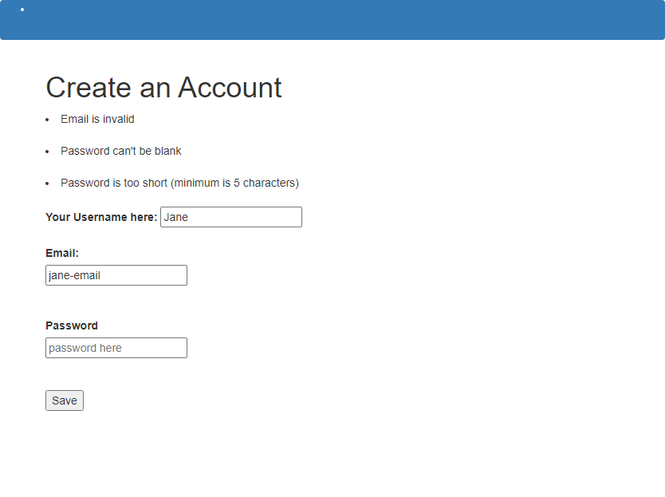

# Re-former

This project actually builds some forms, both using nearly-pure HTML and then graduating to using the helper methods that Rails provides. It is gotten from [The Odin Project](https://www.theodinproject.com/courses/ruby-on-rails/lessons/forms).

### Screenshot



## Tools and technologies used to build this project
1. [Ruby 2.7.1](https://www.ruby-lang.org/en/news/2020/03/31/ruby-2-7-1-released/)
2. [Ruby on Rails 6.0.3.2](https://weblog.rubyonrails.org/2020/6/17/Rails-6-0-3-2-has-been-released/)
3. Bootstrap

## Running and testing it locally

### Prerequisites
1. You should have [Ruby 2.7.1](https://www.ruby-lang.org/en/news/2020/03/31/ruby-2-7-1-released/)
2. You need to have [Rails 6.0.3.2](https://weblog.rubyonrails.org/2020/6/17/Rails-6-0-3-2-has-been-released/)
3. You need to have [Yarn v1.22.4](https://yarnpkg.com/)

### Setup
1. Clone this repository with `https://github.com/Georjane/Forms.git`

1. Go inside this repo locally by typing `cd re-former`

1. Run `bundle install` to install all ruby dependecies

1. Run `yarn` to install js dependencies

1. Run `bin/rails db:migrate` to create necessary tables in database

### Testing
1. Start the server by running `bin/rails server`, if all of the above steps has been followed correctly, you should get a server started on `https://127.0.0.1:3000` or easily `https://localhost:3000`
1. Go to these paths:
```bash
    GET   /users/new => Create a user 1
    GET   /users/1/edit => Edit user 1
```

and observe the changes in your terminal


## Author

### Witah Georjane
* Github: [@Georjane](https://github.com/Georjane)
* Twitter: [@WittyJany](https://twitter.com/WittyJany)
* LinkedIn: [Witah Georjane](https://www.linkedin.com/in/witah-georjane)

## Show your support 
Give a ⭐️ if you like this project!

## Acknowledgment
* [Microverse](https://www.microvese.org)
* [The Odin Project](https://www.theodinproject.com)

